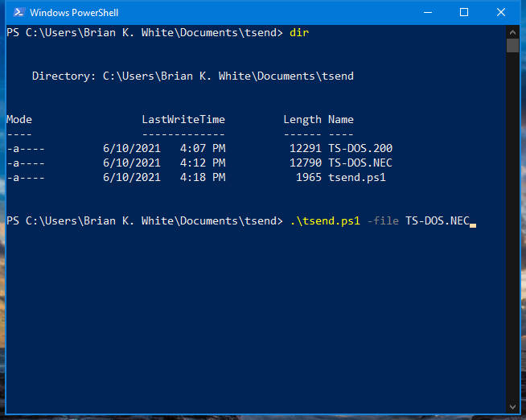
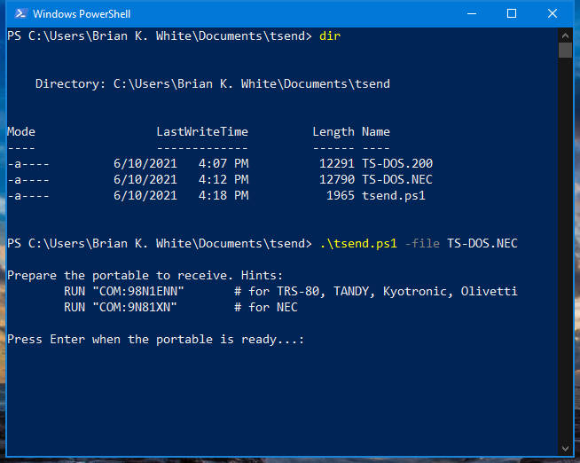
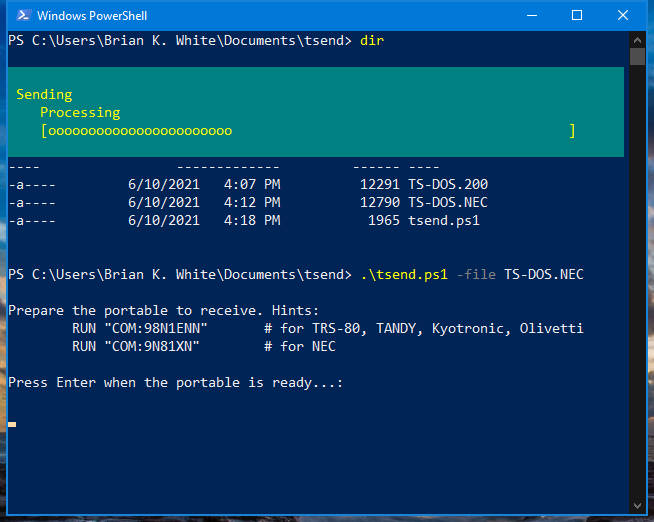

# tsend
Powershell implementation of the bootstrap function in [dl2](https://github.com/bkw777/dl2) and [mComm](http://www.club100.org/memfiles/index.php?&direction=0&order=&directory=Kurt%20McCullum)

dl2 only runs on linux or osx or any other unix-like OS, or on windows but requires cygwin or msys2,  
the bootstrapper in mComm for Windows doesn't seem to work in current Windows versions,  
and the File-> Send file... option in TeraTerm doesn't work either, you have to actually paste the file in the terminal.

So, this provides another option to bootstrap BASIC loaders into TRS-80 Model 100-alikes reliably from Windows.

This writes a specified file out on a specified serial port, one byte at a time with a 6ms pause after each byte sent, followed by a trailing 0x1A (Ctrl-Z) at the end of the file. It's meant to be fed into a `RUN "COM:..."` or `LOAD "COM:..."` command in BASIC on the portable.

Typical uses (files that you would need to send this way):
* [TPDD client installers](https://github.com/bkw777/dl2/tree/master/clients)
* [REX setup files](http://bitchin100.com/wiki/index.php?title=REX)

## Usage
Download tsend.ps1 and one of the files above, for instance TS-DOS.100.

Open a powershell window and cd to the directory where you downloaded the files.

Tell Windows to allow the script to run by running these 2 commands in the powershell window.  
You only need to do these one time the first time after you download the file, not every time you want to run it after that.
```
Set-ExecutionPolicy RemoteSigned -Scope CurrentUser
unblock-file -path .\tsend.ps1  
```

Finally run the script.  
    `.\tsend.ps1 -file TS-DOS.100`  

If there is more than one serial port, it will display a list of all serial ports and you will need to re-run with "-port COM#" added to the command line. Example:  
    `.\tsend.ps1 -port COM6 -file TS-DOS.100`  
    




The transferred file MUST be a plain ascii text file, and generally specifically an ascii format BASIC program.

You could use tsend to transfer a generic text document into TELCOM instead of into BASIC, but there is not much reason to do that. tsend is really intended for "bootstrapping", ie getting a program transferred and running on the client from scratch in as few and simple and reliable repeatable steps as possible, so that the program can then take over and do the rest. For general file transfer, use TPDD, which can handle any kind of file and transfers in both directions. tsend is meant to help get a TPDD client installed in the first place, so that you can then use it for everything else.

The name of the file does not matter on the PC side, only the contents. On any KC-85 clone aka "Model T", ascii text files (whether they are generic documents or ascii format BASIC code) always have the extension .DO, tokenized (binary) BASIC files always have the extension .BA , and binary machine-language programs have the extension .CO . But on the internet or your modern pc, any kind of file might have any kind of filename or extension. For instance, the [collection of TPDD client installers bundled with dl2](https://github.com/bkw777/dl2/tree/master/clients) have filenames reflecting the machine they target, ex: TS-DOS.100 vs TS-DOS.NEC etc.

On the internet, many BASIC files are archived with a .BA extension even though they are really ascii files and would require a .DO extension if they were on the portable. This can cause confusion until you know about it, but it was done for a few different valid reasons. Any place other than on the portable or in an emulator, the tokenized .BA files are not directly readable or usable. For archival and reference purposes, the ascii version is more useful. It's like the source .c file to a compiled executable. On the portable, the ascii version of FOO.BA would normally be FOO.DO, but many programs already had an accompanying file named FOO.DO for the documentation. So, it became somewhat of a convention to store BASIC files on bulletin boards and the internet in ascii format but with a .BA extension. The file contains the readable ascii BASIC source code, and outside of the target machine or emulator the .BA extension is just intended to document that the contents are a BASIC program rather than the manual, but not tokenized BASIC.

And other times a .BA file (from the internet) is an actual binary tokenized .BA file.

Any time you get a .DO file from the internet, it is probably an ascii text file and safe to transfer (It may or may not be a BASIC program and may or may not RUN, but it is safe to *transfer*).

Any time you get a .BA file from the internet, you have to actually look at the contents to determine if it is plain ascii text or tokenized (binary) inside. If you get a file from the internet that has a .BA extension, but the contents are human-readable ascii text, then you can bootstrap that file with tsend.

After using tsend to install TS-DOS or other [TPDD client](http://tandy.wiki/TPDD_client), then you could use [LaddieAlpha](http://bitchin100.com/wiki/index.php?title=LaddieCon#LaddieAlpha) or other [TPDD server](http://tandy.wiki/TPDD_server) to share files with the portable.

You can use tsend to run any ascii BASIC program, not just TPDD client installers. For example, the [REX#](http://bitchin100.com/wiki/index.php?title=REXsharp#Software) update util. Assuming a REX# and a Model 100 for the purpose of this example, download tsend.ps1, LaddieAlpha.EXE, and the latest RX#\*.ZIP, extract the zip, all into the same temp directory, then run:  
`.\tsend.ps1 -file rx#u1.do ;.\LaddieAlpha.EXE com6 6`  
tsend will transfer rx#u1.do to the 100, and then Laddie will start listening for TPDD commands. The RUN command you were prompted to type into the 100 will execute rx#u1.do, which will use TPDD commands to load other files from your pc as it works to flash new firmware onto the REX#.

This same process also works for the [REXCPM setup utils](http://bitchin100.com/wiki/index.php?title=REXCPM#Software). Download and extract the latest REXCPM*.ZIP, and the [CP/M install files](http://bitchin100.com/wiki/index.php?title=M100_CP/M#Installation_and_Set_Up), then:
`.\tsend.ps1 -file rxcini.DO ;.\LaddieAlpha.EXE com6 6`  
Once rxcini.DO is done and RXCMGR is installed, you use that to load the option rom image of TS-DOS into the REXCPM, then use *that* to copy cpmupd.co to the 100, then run *that* to install the cpm210 or cpm410 disk image. There are more details than just this. Consult the REXCPM docs above to for the full directions. You have to issue CLEAR statements and press reset and power-cycle at different points along the way.

You can also use the LOAD command in place of the RUN command on the client machine, to transfer and keep a program rather than to immediately execute-and-disacard it.
`.\tsend.ps1 -file MYPROG.DO`  
Then on the client:  
```
NEW
LOAD "COM:98N1ENN"
SAVE "MYPROG"
```
This transfers the ascii BASIC MYPROG.DO into the BASIC interpreter on the 100 as if you typed it in, then saves a binary tokenized BASIC version of it as MYPROG.BA on the 100.

Keywords: TRS-80 TANDY Model 100 102 200 Kyotronic KC-85 NEC PC-8201 PC-8300 Olivetti M-10 TEENY TS-DOS DKSMGR TPDD LaddieCon LaddieAlpha mComm dlplus dl2 Desk-Link
